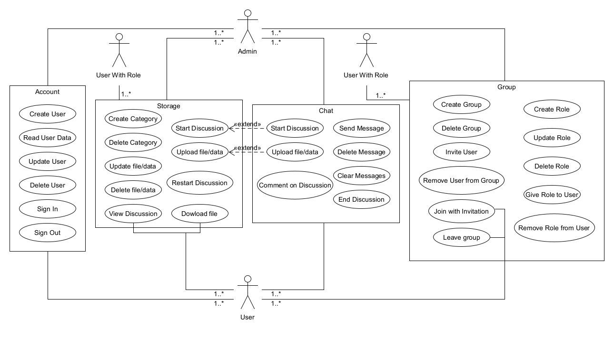

# Project Brainstorm - Software  Requirements Specification

## Table of Contents
- [Table of contents](#table-of-contents)
- [Introduction](#1-introduction)
    - [Purpose](#11-purpose)
    - [Scope](#12-scope)
    - [Definitions, Acronyms and Abbreviations](#13-definitions-acronyms-and-abbreviations)
    - [References](#14-references)
    - [Overview](#15-overview)
- [Overall Description](#2-overall-description)
    - [Vision](#21-vision)
    - [Use Case Diagram](#22-use-case-diagram)
	- [Technology Stack](#23-technology-stack)

## 1. Introduction

### 1.1 Purpose
This Software Requirements Specification (SRS) describes all specifications for the application "Brainstorm". It includes an overview about this project and its vision, detailed information about the planned features and boundary conditions of the development process.

### 1.2 Scope
The project is going to be realized as an Android, IOS and WebApp.

Actors of this App can be users or group-administrators. Whereby users can be bestoved with roles created and managed by the admin, which grant them with more possibilities to interact with the App.

Planned Subsystems are:
* tbd

### 1.3 Definitions, Acronyms and Abbreviations
| Abbrevation | Explanation                            |
| ----------- | -------------------------------------- |
| SRS         | Software Requirements Specification    |
| UC          | Use Case                               |
| n/a         | not applicable                         |
| tbd         | to be determined                       |
| UCD         | overall Use Case Diagram               |
| FAQ         | Frequently asked Questions             |

### 1.4 References

| Title                                                                                             | Date       | Publishing organization   |
| -------------------------------------------------------------------                               |:----------:| ------------------------- |
| [Project Brainstorm Blog](https://github.com/TimSchoendorf/Brainstorm/discussions/categories/blog)| 18.10.2018 | Preoject Brainstorm Team  |

### 1.5 Overview
The following chapter provides an overview of this project with vision and Overall Use Case Diagram. The third chapter (Requirements Specification) delivers more details about the specific requirements in terms of functionality, usability and design parameters. Finally there is a chapter with supporting information. 

## 2. Overall Description

### 2.1 Vision
Akin to existing apps like Microsoft Teams, which provide chat and data storage capabilities, we want to build an application which even exceeds those capabilities. The biggest differentiating factor herein will be the hightened focus on the data storage and management functionality. Although similar to Teams, this will grant the possibility to upload, save, manage and download data as well as categorise it and start up discussions for these categories and files. This will enable teams and groups to thoroughly discuss ideas or problems on the basis of files and data, while still enabling a standard chat functionality on top of that. Furthermore we plan to build integrations with other apps like JIRA in which i.e. epics or stories can be automatically created with information and data from those categories and discussions.

### 2.2 Use Case Diagram

- Colors - tbd

### 2.3 Technology Stack
The technology we use is:

tbd

#### 3.1.1 Send Message
Since the project is about a group chat, sending messages is one of the most essential features of this app.
The user has the possibility to post messages to a group just as you are able to do with any other messaging service out there.
[Sending a message](./use_cases/chat_engine/Send_Message.md)

#### 3.1.2 Delete Message
While there can be a lot of constructive things in a chat, sometimes there is stuff you don't need or want to outright remove for reasons.
Therefore you can delete your own messages and if you have the appropriate role, even remove the ones of others.
[Deleting a message](./use_cases/chat_engine/Delete_Message.md)

#### 3.1.3 Clear Messages
This is a functionality that most modern chat apps come with so we wanted to provide it as well. It should only be possible to clear
the entire chat with the appropriate role to avoid any misuse of the functionality. 
[Clearing a message](./use_cases/chat_engine/Clear_Messages.md)

#### 3.1.4 Start Discussion
The most essential part of the app is the capability for users to start discussions on files or hyperlinks that were posted inside 
the group chat and add those files/discussions to categories that are defined by the group(admin).
[Starting a discussion](./use_cases/chat_engine/Start_Discussion.md)

#### 3.1.5  End Discussion
When a discussion is over, or you don't want any more comments on a certain topic, you can end the discussion, practically archiving it and only
allowing a read mode on what was discussed so far.
[Ending a discussion](./use_cases/chat_engine/End_Discussion.md)

#### 3.1.6 Comment on Discussion
As stated above, the ability to write comments on a post inside the existing chat allows for more focused discussions on said topic and as well
the option to have all of it in one place, accessable through the categorie storage.
[Commenting a discussion](./use_cases/chat_engine/Comment_On_Discussion.md)

#### 3.1.7 Upload File/Data
This part is also essential, since discussions are created on a file/date or hyperlink, being able to upload/post them is the backbone of the chat
functionality.
[Uploading a File](./use_cases/chat_engine/Upload_File_Data.md)
