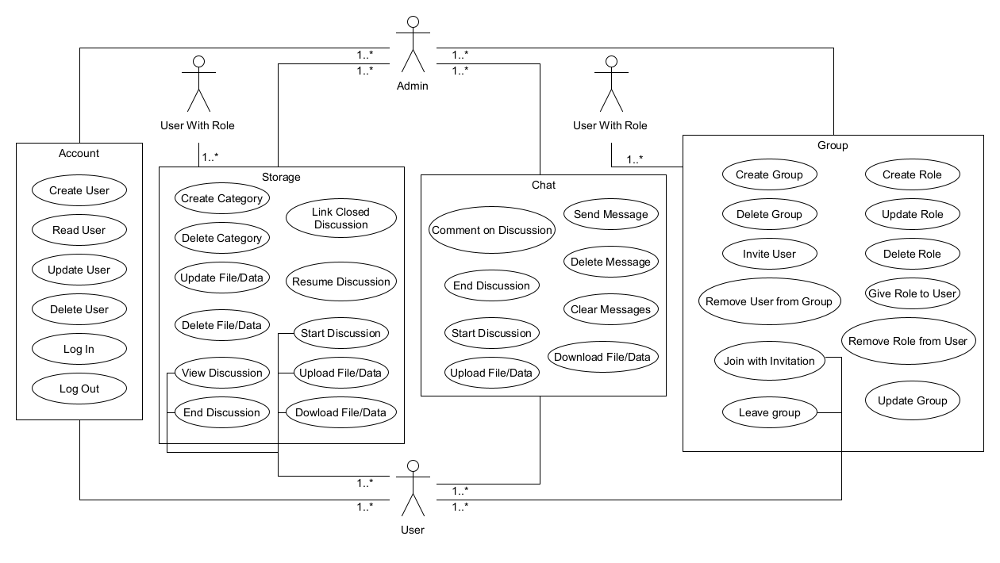

# Project Brainstorm - Software Requirements Specification

## Table of Contents
- [Table of contents](#table-of-contents)
- [Introduction](#1-introduction)
    - [Purpose](#11-purpose)
    - [Scope](#12-scope)
    - [Definitions, Acronyms and Abbreviations](#13-definitions-acronyms-and-abbreviations)
    - [References](#14-references)
    - [Overview](#15-overview)
- [Overall Description](#2-overall-description)
    - [Vision](#21-vision)
    - [Use Case Diagram](#22-use-case-diagram)
	- [Technology Stack](#23-technology-stack)
- [Specific Requirements](#3-specific-requirements)
    - [Functionality](#31-functionality)
    - [Usability](#32-usability)
    - [Reliability](#33-reliability)
    - [Performance](#34-performance)
    - [Supportability](#35-supportability)
    - [Design Constraints](#36-design-constraints)
    - [Online User Documentation and Help System Requirements](#37-on-line-user-documentation-and-help-system-requirements)
    - [Purchased Components](#purchased-components)
    - [Interfaces](#39-interfaces)
    - [Licensing Requirements](#310-licensing-requirements)
    - [Legal, Copyright And Other Notices](#311-legal-copyright-and-other-notices)
    - [Applicable Standards](#312-applicable-standards)
- [Supporting Information](#4-supporting-information)

## 1. Introduction

### 1.1 Purpose
This Software Requirements Specification (SRS) describes all specifications for the application "Brainstorm". It includes an overview about this project, its vision and detailed information about the planned features and boundary conditions of the development process.

### 1.2 Scope
The project is going to be realized as an Android, IOS and WebApp.

Actors of this App can be users or group-administrators. Whereby users can be bestoved with roles created and managed by the admin, which grant them with more possibilities to interact with the App.

Planned Subsystems are:
- User Management
- Storage Warehouse
- User Experience
- Apps

### 1.3 Definitions, Acronyms and Abbreviations
| Abbrevation | Explanation                            |
| ----------- | -------------------------------------- |
| SRS         | Software Requirements Specification    |
| UC          | Use Case                               |
| n/a         | not applicable                         |
| tbd         | to be determined                       |
| UCD         | overall Use Case Diagram               |
| FAQ         | Frequently asked Questions             |

### 1.4 References

| Title                                                                                             | Date       | Publishing organization   |
| -------------------------------------------------------------------                               |:----------:| ------------------------- |
| [Project Brainstorm Blog](https://github.com/TimSchoendorf/Brainstorm/discussions/categories/blog)| 18.10.2022 | Preoject Brainstorm Team  |

### 1.5 Overview
The following chapter provides an overview of this project with vision and Overall Use Case Diagram. The third chapter (Requirements Specification) delivers more details about the specific requirements in terms of functionality, usability and design parameters. Finally there is a chapter with supporting information. 

## 2. Overall Description

### 2.1 Vision
Akin to existing apps like Microsoft Teams, which provide chat and data storage capabilities, we want to build an application which even exceeds those capabilities. The biggest differentiating factor herein will be the hightened focus on the data storage and management functionality. Although similar to Teams, this will grant the possibility to upload, save, manage and download data as well as categorise it and start up discussions for these categories and files. This will enable teams and groups to thoroughly discuss ideas or problems on the basis of files and data, while still enabling a standard chat functionality on top of that. Furthermore we plan to build integrations with other apps like JIRA in which i.e. epics or stories can be automatically created with information and data from those categories and discussions.

### 2.2 Use Case Diagram

- Colors - tbd

### 2.3 Technology Stack
The technology we use is:

Backend:
- Spring Boot
- AppWrite
- Keycloak
- Maven
- H2 Database (tbd)

Frontend:
- Flutter
- Gradle

IDE:
- Eclipse/IntelliJ
- Visual Studio Code
- Android Studio

Project Management:
- JIRA
- GitHub
- WhatsApp

Deployment:
- docker
- tbd.

Testing:
- JUnit and Mockito
- package:test (Dart)
- tbd.

## 3. Specific Requirements

### 3.1 Functionality

#### 3.1.1 Account

#### 3.1.2 Storage

##### 3.1.2.1 Create Category
As to be expected of any data saving service, there is the possibility to save the files in coresponding categories, which will behave much like folders would under a normal OS. Like a folder this categories can be created with a name and additionally with a description.

[Creating a Category](./use_cases/storage_warehouse/Create_Category.md)

##### 3.1.2.2 Delete Category
When a category is no longer needed it should be deleted. With this the to delete category will disappear from the category list and the database. In the case of files still existing in this category, they will be moved to the enclosing category or the root.

[Deleting a Category](./use_cases/storage_warehouse/Delete_Category.md)

##### 3.1.2.3 Start Discussion
Additionally to the chat functionality it is allowed to start up a discussion connected to one file. This will be an in itself contained discussion, which can be viewed as such and edited through a new tab in the chat. This enables pointed, data driven conversations.

[Starting a Discussion](./use_cases/storage_warehouse/Start_Discussion.md)

##### 3.1.2.4 Resume Discussion
If a discussion has been ended but there are still points one person wants to bring up or there is the need to reevaluate the discussion as a whole, there should be the possibility to "revive" it. The status is updated and it is shown again.

[Resuming a Discussion](./use_cases/storage_warehouse/Resume_Discussion.md)

#### 3.1.3 Chat

##### 3.1.3.1 Send Message
Since the project is about a group chat, sending messages is one of the most essential features of this app.
The user has the possibility to post messages to a group just as you are able to do with any other messaging service out there.

[Sending a message](./use_cases/chat_engine/Send_Message.md)

##### 3.1.3.2 Delete Message
While there can be a lot of constructive things in a chat, sometimes there is stuff you don't need or want to outright remove for reasons.
Therefore you can delete your own messages and if you have the appropriate role, even remove the ones of others.

[Deleting a message](./use_cases/chat_engine/Delete_Message.md)

##### 3.1.3.3 Clear Messages
This is a functionality that most modern chat apps come with so we wanted to provide it as well. It should only be possible to clear
the entire chat with the appropriate role to avoid any misuse of the functionality. 

[Clearing a message](./use_cases/chat_engine/Clear_Messages.md)

##### 3.1.3.4 Start Discussion
The most essential part of the app is the capability for users to start discussions on files or hyperlinks that were posted inside 
the group chat and add those files/discussions to categories that are defined by the group(admin).

[Starting a discussion](./use_cases/chat_engine/Start_Discussion.md)

##### 3.1.3.5 End Discussion
When a discussion is over, or you don't want any more comments on a certain topic, you can end the discussion, practically archiving it and only
allowing a read mode on what was discussed so far.

[Ending a discussion](./use_cases/chat_engine/End_Discussion.md)

##### 3.1.3.6 Comment on Discussion
As stated above, the ability to write comments on a post inside the existing chat allows for more focused discussions on said topic and as well
the option to have all of it in one place, accessable through the categorie storage.

[Commenting a discussion](./use_cases/chat_engine/Comment_On_Discussion.md)

##### 3.1.3.7 Upload File/Data
This part is also essential, since discussions are created on a file/date or hyperlink, being able to upload/post them is the backbone of the chat
functionality.

[Uploading a File](./use_cases/chat_engine/Upload_File_Data.md)

#### 3.1.4 Group

### 3.2 Usability
Due to local caching the chats can allways be accessed even if the users are offline.

### 3.3 Reliability
The brainstorm application can be accessed with IOS, Android, Windows and with a web browser, so that every team can use and rely on it. 

### 3.4 Performance
In general it can be said that the speed of uploading messages or files depends a lot on the number of requests to the server. But for our usecase of a small number of users the performance should meet the requirement standards.

### 3.5 Supportability
However, to prevent errors early on, we use unit tests. Since our user group will be very small and manageable, we rely on personal contact if additional errors should occur.

### 3.6 Design Constraints
Back-End and Front-End will be kept separately. While the frontend is completly constructed with flutter, the backend is made with supabase, which provides a certain security level. 

### 3.7 On-line User Documentation and Help System Requirements
The usage of the app should be as intuitive as possible so it won't need any further documentation. If the user needs some help we will make a FAQ and and some intuitve image tutorials to the most important functions and workflows. 

### 3.8 Purchased Components
tbd

### 3.9 Interfaces
#### 3.9.1 User Interfaces
The User interfaces we will implement:
- Login Page (Create a new account or log in)
- Overview Page (See all of your group chats)
- Setting Page (Manage your account)
- Chat Page (Read and write messages)
- Storage Page (Search, upload, download or delete file of the group storage)

#### 3.9.2 Hardware Interfaces
(n/a)

#### 3.9.3 Software Interfaces
The application will be available as a ios, android and windows application and website.

#### 3.9.4 Communication Interfaces
The users can communicate with applications and the webpage using the http/https protocol.

### 3.10 Licensing Requirements
tbd

### 3.11 Legal, Copyright, and Other Notices
We do not take responsibility for any incorrect data or errors in the application.

### 3.12 Applicable Standards
The development will follow the clean common code standards and naming conventions.

## 4. Supporting Information
For any further information you can contact the Brainstornm Team via Discord. The Team Members are:
- Jonas Nuber
- Magnus Henning
- Moritz Müller
- Tim Schöndorf
- Tim Wortmann
