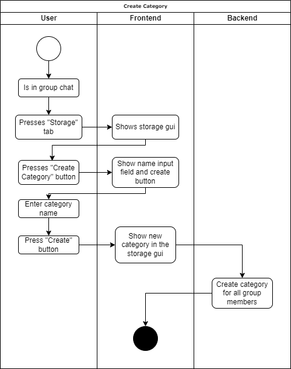

# Use-Case Specification: Creating a Category

# 1. Creating a Category

## 1.1 Brief Description
As to be expected of any data saving service, there is the possibility to save the files in coresponding categories, which will behave much like folders would under a normal OS. Like a folder this categories can be created with a name and additionally with a description.

## 1.2 Mockup
[//]: # ()

## 1.3 Screenshots

# 2. Flow of Events

## 2.1 Basic Flow

### Activity Diagram

### .feature File
n/a

## 2.2 Alternative Flows

# 3. Special Requirements

# 4. Preconditions
- The user has an account
- The user created/joined a group
- The User is either one of the admins or has a role which authorizes him for the action

# 5. Postconditions
- A category is created

### 5.1 Save changes / Sync with server

# 6. Effort Estimation
3