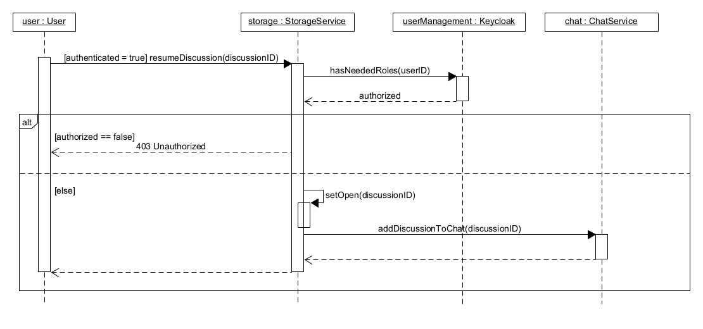

# Project Brainstorm - Use-Case Realization Specification: Start Discussion

## Table of Contents
- [Table of contents](#table-of-contents)
- [Introduction](#1-introduction)
    - [Purpose](#11-purpose)
    - [Scope](#12-scope)
    - [Definitions, Acronyms and Abbreviations](#13-definitions-acronyms-and-abbreviations)
    - [References](#14-references)
    - [Overview](#15-overview)
- [Flow of Events - Design](#2-flow-of-events)
- [Derived Requirements](#3-derived-requirements)

## 1. Introduction

### 1.1 Purpose: 
If a discussion has been ended but there are still points one person wants to bring up or there is the need to reevaluate the discussion as a whole, there should be the possibility to "revive" it. The status is updated and it is shown again.

### 1.2 Scope: 
A User with the correspondig role should be authorized to resume a selected discussion, which then can be viewed and interacted with from the usual places.

### 1.4 References: 
https://github.com/TimSchoendorf/Brainstorm 

### 1.5 Overview: 
This Use-Case-Realization Specification will contain a sequence diagram, explaining the internal structure and flow while resuming a discussion.

## 2. Flow of Events - Design
To resume a disscusion, the id of said discussion has to be provided (happens internally when the resum button is clicked). The user is authorized and if the needed requirements are met, the discussion is reopened.

